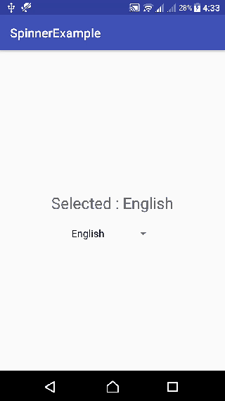

# HW_Week03_Day02
The Home Work has to be delievered before 9AM ⚠️

# Instructions 📋
---
## Part I
### Create an app contains one activity.
- The activity contains a spinner.
- When you choose language from the spinner, show the selected language in a TextView.

Output:
-

# Learning Resources  📚
* [Spinner in kotlin](https://www.geeksforgeeks.org/spinner-in-kotlin/)

